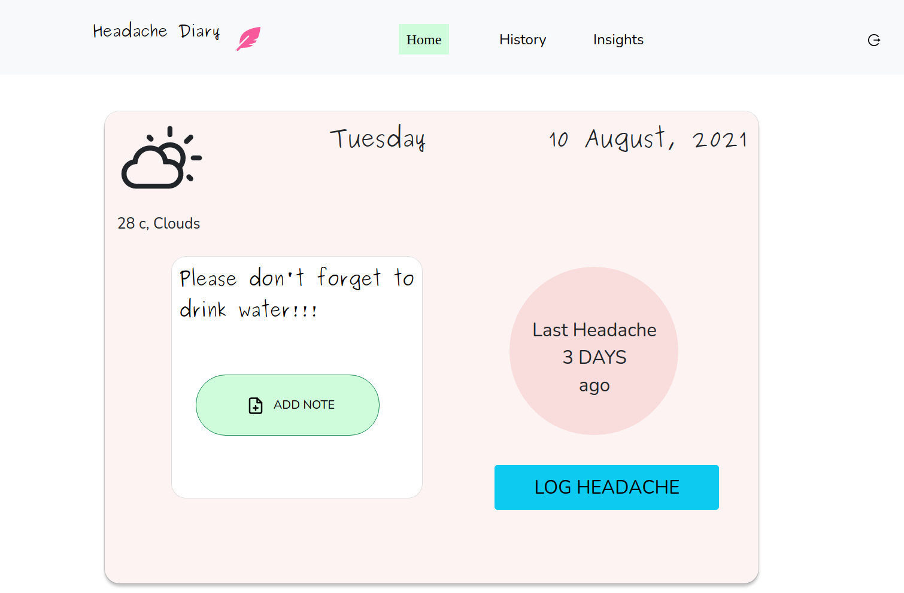

# Headache Diary

Headache diary is an app close to people who suffer from headaches often. It's a diary that keeps track of the types of headaches including triggers, symptoms, location, medicines and outdoor status. It displays the better vizualization of the patterns of headaches which also has note to self feature. History can easily be accessed and can be filtered according to different categories.

# Screenshot



<p float="left">
  
   
  
</p>

## Demo

https://romantic-northcutt-5df973.netlify.app/

## Installation

To use this project on your machine, simply clone this GitHub repository, install dependencies and launch the program.

### Clone Repo

```bash
git clone https://github.com/eternal-moon/Headache-Diary.git
```

### Install Dependencies

[Install npm](https://docs.npmjs.com/downloading-and-installing-node-js-and-npm/)

### Launch Project

```bash
cd Headache-Diary
npm start
```

## Tech Stack

- React
- Bootstrap
- Firebase
